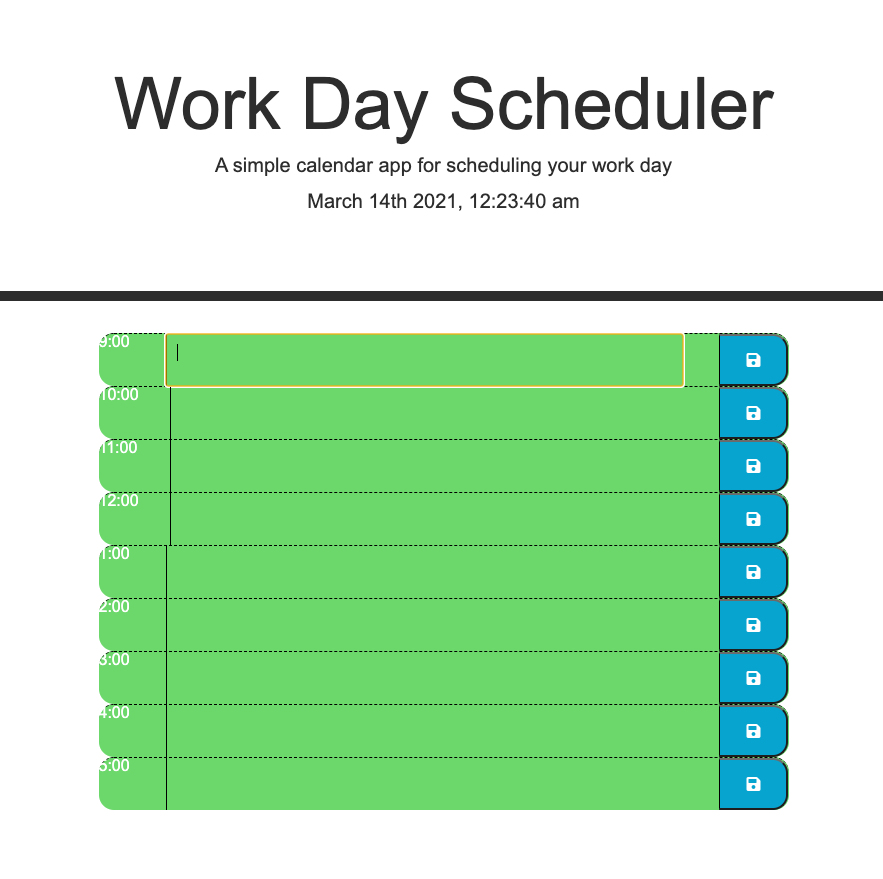

# 05-work-day-scheduler

## Description

- Assignment utilizes HTML, CSS, JAvaScript & jQuery to produce a normal business hour task or event scheduler

- Displays date/time in header

- Ability to store values in textareas by clicking save button

- Stored data persists

## Screenshot

## Deployed URL

https://davidboerm.github.io/05-work-day-scheduler/